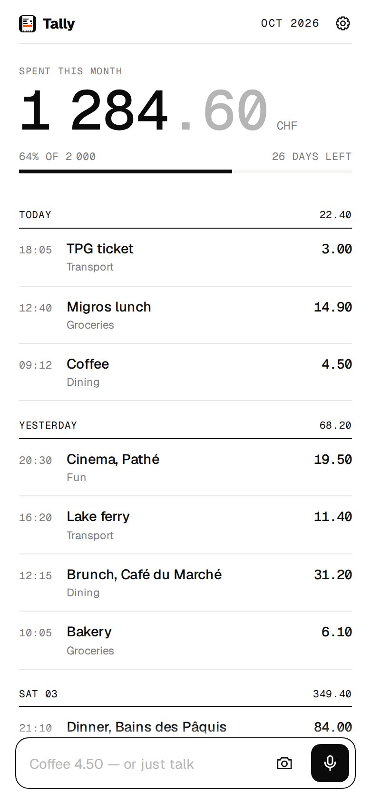
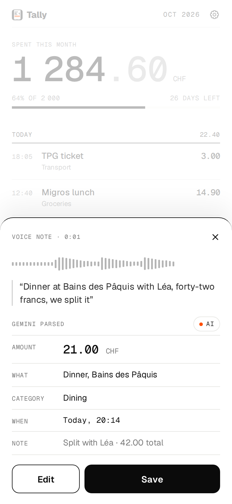
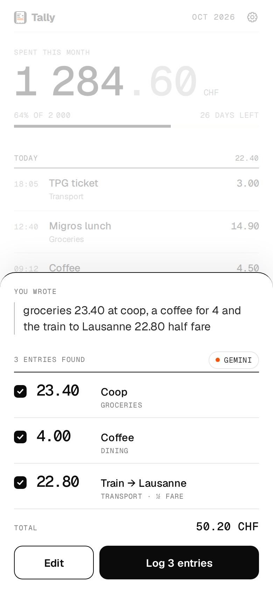
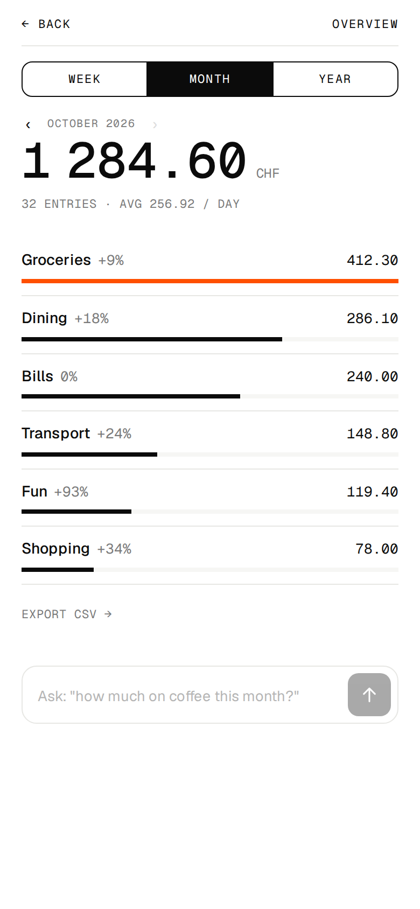

# Tally

Minimal, AI-assisted expense tracker. A web app / PWA on Cloudflare.

Log an expense by typing a sentence, speaking, or snapping a receipt. Gemini, called from your
browser with **your own Google AI Studio key**, turns it into structured entries. One sentence can
become several entries ("groceries 23.40 at Coop, a coffee for 4 and the train 22.80"). Ask your
data questions in plain language ("how much on coffee this month?"). Get nudged by push
notifications: a daily reminder, budget alerts, a weekly summary and a monthly report.

Design: round 01 is in [`design/index.html`](design/index.html) (hosted at
https://tally-design.pages.dev). The app implements layout **A — Ledger** with the **I2 Receipt**
icon. The build spec lives in [`docs/SPEC.md`](docs/SPEC.md).

<p align="center">
  
  
  
  
</p>

## Features

- **Ledger home**: month total with budget progress, entries grouped by day, one composer bar.
- **Three ways to log**: type, hold the mic and talk, or photograph a receipt.
- **Confirm sheet**: what Gemini parsed (amount, what, category, when, note), editable, single or batch.
- **Overview**: week / month / year, category bars with deltas against the previous period, CSV export.
- **Ask your data**: a question box answered by Gemini over the entries of the visible period.
- **Settings**: Gemini key and model, currency, language (Auto / EN / FR), budget, categories,
  notifications, account, install hints.
- **Push notifications**: daily reminder at your time (optionally only if nothing was logged),
  alerts at 50 / 80 / 100 % of the budget, Monday summary, first-of-month report, test button,
  per-device management, notification actions ("Log now", "Skip today").
- **Multi-user**: email + password accounts; optional invite code; sign-ups can be closed.
- **PWA**: installable, offline shell, self-hosted fonts, no third-party scripts or analytics.

## How it works

```
 Browser (Preact PWA)                     Cloudflare
 ┌──────────────────────────┐   HTTPS    ┌─────────────────────────────┐
 │ UI · service worker      │◄──────────►│ Worker (Hono)               │
 │ Gemini key (localStorage)│  /api/*    │  static assets + JSON API   │
 └───────────┬──────────────┘            │  Web Push sender · cron     │
             │ audio / text / photo       └──────────────┬──────────────┘
             ▼                                           ▼
   Google Gemini (your key)                       D1 (SQLite)
```

- The Gemini key never reaches the Worker: audio, text and photos go straight from the device to
  Google, and only the resulting entries are saved.
- One Worker serves the built app from `dist/` and the API under `/api/*`. Data lives in D1.
- Web Push is implemented with WebCrypto (VAPID + `aes128gcm`); a cron trigger runs every 15 minutes
  for reminders and summaries, budget alerts fire right when an entry crosses a threshold.

## Local development

Prerequisites: Node 22, npm 10.

```sh
npm install                 # also generates worker-configuration.d.ts
npm run vapid               # writes VAPID keys for Web Push into .dev.vars
npm run db:migrate:local    # creates the local D1 database
npm run dev                 # Vite on http://localhost:5173 (+ wrangler on :8787 for /api)
```

Or run the built app the way production serves it:

```sh
npm run preview             # build, migrate, then wrangler dev on http://127.0.0.1:8787
```

Create an account, paste a Gemini key from https://aistudio.google.com/app/apikey (the free tier is
enough), pick your defaults, and start logging.

Useful scripts:

| Script | What it does |
| --- | --- |
| `npm run check` | Typecheck the app and the Worker |
| `npm test` | Unit tests (node) + Worker tests (inside workerd with D1) |
| `npm run e2e` | Playwright end-to-end tests against a built app with Gemini mocked |
| `npm run icons` | Re-render the pixel icon to `public/icons/` |
| `npm run types` | Regenerate `worker-configuration.d.ts` after changing `wrangler.jsonc` |

## Deploying to Cloudflare

Everything fits in Cloudflare's free tier (Workers, D1, cron triggers).

1. `npx wrangler login`
2. `npm run setup:cloudflare` — creates the D1 database `tally` and writes its id into `wrangler.jsonc` (commit that change).
3. Secrets (once):
   ```sh
   node scripts/vapid.mjs --print          # generate a production VAPID pair
   npx wrangler secret put VAPID_PUBLIC_KEY
   npx wrangler secret put VAPID_PRIVATE_KEY
   npx wrangler secret put VAPID_SUBJECT   # e.g. mailto:you@example.com
   npx wrangler secret put INVITE_CODE     # optional: require a code to sign up
   ```
4. `npm run deploy` — builds, applies migrations remotely, deploys to `tally.<your-subdomain>.workers.dev`.

**GitHub Actions**: `.github/workflows/deploy.yml` deploys on every push to `main` once the
repository secrets `CLOUDFLARE_API_TOKEN` (template "Edit Cloudflare Workers", plus D1 edit) and
`CLOUDFLARE_ACCOUNT_ID` exist. Without them the workflow skips itself.

Configuration (`wrangler.jsonc` vars / secrets):

| Name | Kind | Meaning |
| --- | --- | --- |
| `SIGNUPS_ENABLED` | var | `"false"` closes sign-ups (default `"true"`) |
| `INVITE_CODE` | secret | when set, sign-up requires this code |
| `VAPID_PUBLIC_KEY`, `VAPID_PRIVATE_KEY`, `VAPID_SUBJECT` | secrets | Web Push identity (`npm run vapid` locally) |

## Push notifications

Enable them in **Settings → Notifications** on each device. Android and desktop browsers work
directly; on iPhone/iPad, add Tally to the Home Screen first (Share → Add to Home Screen), then
enable notifications from the installed app (iOS 16.4+). Reminders arrive at the first quarter-hour check at or after your time (never early). Reminder time and the notification kinds
are account-wide; subscriptions are per device and can be removed from the device list. The
"Skip today" action on a reminder silences that day's reminder.

## Privacy and security

- Your Gemini key is stored only in your browser (`localStorage`) and sent only to Google.
- Passwords are hashed with PBKDF2-SHA256 (100 000 iterations); sessions are opaque tokens stored
  hashed, in an `HttpOnly` `SameSite=Lax` cookie. Cross-origin mutations are refused. Login is
  throttled per email and address.
- Push payloads are end-to-end encrypted (RFC 8291). The Worker only stores the subscription.
- Export your data any time as CSV. Deleting the account removes everything.

Known limitations of this version: no email verification and no password reset (there is no email
provider), no offline queueing of entries (the shell works offline, logging needs a connection).

## Project layout

```
design/          design round 01 (reference only, not part of the build)
docs/SPEC.md     implementation spec
migrations/      D1 SQL migrations
public/          manifest, icons, fonts
scripts/         icons.mjs · vapid.mjs · setup-cloudflare.mjs
src/shared/      API contract types, money/date helpers, zod schemas
src/worker/      Cloudflare Worker: auth, routes, push (Web Push, cron)
src/app/         Preact PWA: screens, components, i18n, Gemini client, service worker
tests/           unit (node) and Worker (workerd) tests
e2e/             Playwright end-to-end tests
```
